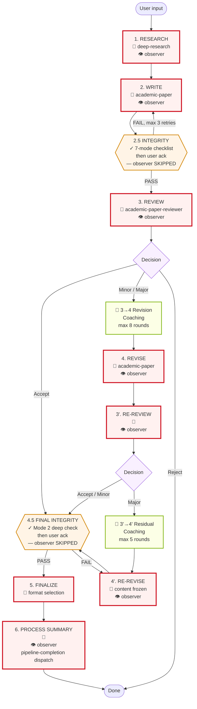
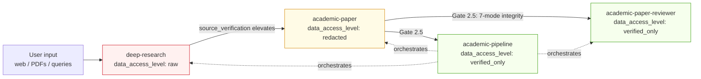
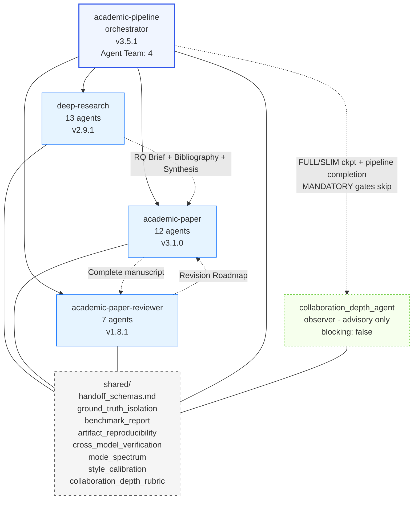
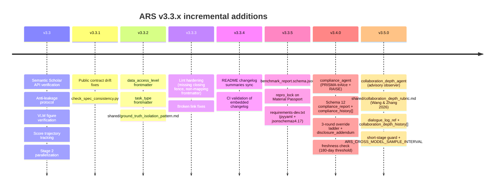

# ARS Pipeline Architecture (v3.5.1)

Full pipeline view across stages × skills × artifacts × gates. Every completed stage requires a user-confirmation checkpoint (per `academic-pipeline/SKILL.md` and `pipeline_state_machine.md`); the diagrams below surface the **decision-heavy** checkpoints visually so they are easy to locate. The post-stage confirmation checkpoints at 2.5 and 4.5 are machine-verified first, then confirmed by the user — they are not skipped.

## How to read

- **Flow diagram** (§2): macro view — which stage follows which, where loops exist, where gates block. Every rectangle ends in a post-stage user confirmation (elided for readability); 🧑 markers call out the decision-heavy moments where the user chooses a branch.
- **Matrix** (§3): the only place where (stage × skill × mode × data_level × artifacts × agents × gate) all co-exist. Use this when asking "what happens at Stage X?" The Gate column lists both machine checks and the user-confirmation checkpoint that closes the stage.
- **Data access flow** (§4) and **skill graph** (§5): orthogonal views answering "who sees what" and "who depends on what" respectively.
- **Quality gates** (§6): zoom on the blocking checks — both machine-enforced and human-enforced.
- **Timeline** (§7): why the architecture looks the way it does — each v3.3.x release added one honesty primitive.
- **Modes** (§8): reference when composing a pipeline invocation.

The matrix alone is insufficient: it hides data-access hierarchy and skill dependency. The diagrams alone are insufficient: they hide artifact flow and per-stage agent detail. Together they are the full architecture.

## 1. Checkpoints (at-a-glance)

The pipeline has **two classes of user checkpoint**. Both require the user to confirm before the pipeline advances; they differ in what the user is actually deciding.

**Decision-heavy checkpoints** — the user chooses a branch or accepts a material decision:

| # | Stage | What the user decides |
|---|---|---|
| 🧑 1 | 1. RESEARCH | RQ Brief + Methodology Blueprint |
| 🧑 2 | 2. WRITE | Outline approval before drafting |
| 🧑 3 | 3. REVIEW | Editorial decision (Accept / Minor / Major / Reject) |
| 🧑 4 | 3 → 4 Revision Coaching | Revision strategy (up to 8 Socratic rounds; user can skip) |
| 🧑 5 | 4. REVISE | Revision changes confirmed |
| 🧑 6 | 3'. RE-REVIEW | Verification-review decision |
| 🧑 7 | 3' → 4' Residual Coaching | Residual-issue trade-offs (up to 5 Socratic rounds; user can skip) |
| 🧑 8 | 4'. RE-REVISE | Content frozen — no further review loop |
| 🧑 9 | 5. FINALIZE | Output format selection (MD / DOCX / LaTeX / PDF) |
| 🧑 10 | 6. PROCESS SUMMARY | Language confirmation + collaboration quality review |

**Post-stage confirmation checkpoints** — machine verification runs first; the user then acknowledges the integrity report before proceeding. These are also user-gated (per `pipeline_state_machine.md` — every stage ends in `[checkpoint]`), but the decision is "acknowledge the automated report" rather than "choose a branch":

| # | Stage | What runs | What the user acknowledges |
|---|---|---|---|
| ✓ 1 | 2.5 INTEGRITY | 7-mode failure checklist (see §3 for exact taxonomy) | Integrity Report PASS/FAIL + any SUSPECTED flags |
| ✓ 2 | 4.5 FINAL INTEGRITY | Deep Mode 2 check, zero-tolerance | Final Integrity Report PASS + populated Material Passport |

## 2. Pipeline Flow

**Legend:**
- **Solid red (🧑)** = decision-heavy human gate — the user chooses a branch or approves a material decision.
- **Solid orange (✓)** = integrity gate — machine verification runs first, user then acknowledges the report. Not skipped.
- **Green** = Socratic coaching sub-stage. User may engage or say "just fix it" to skip the dialogue.
- **👁 observer** (v3.5.1) = `collaboration_depth_agent` dispatches at every FULL/SLIM checkpoint + pipeline completion. **Never blocks.** Advisory only. MANDATORY integrity gates (2.5 / 4.5) explicitly skip the observer so compliance checks are not diluted.

## 3. Stage × Dimension Matrix

| Stage | Skill / Mode | Data level | Artifact produced | Core agents | Gate / Checkpoint |
|---|---|---|---|---|---|
| **1. RESEARCH** | `deep-research` v2.9.1 (full / socratic / lit-review / systematic-review / fact-check / review / quick) | RAW | RQ Brief; Methodology Blueprint; Annotated Bibliography (S2-verified); Synthesis Report; INSIGHT Collection | research_question_agent; research_architect_agent; bibliography_agent; source_verification_agent; synthesis_agent; meta_analysis_agent; editor_in_chief_agent; devils_advocate_agent; risk_of_bias_agent; ethics_review_agent; socratic_mentor_agent; report_compiler_agent; monitoring_agent (13 agents); **👁 collaboration_depth_agent (v3.5.1, advisory)** | 🧑 **Decision-heavy checkpoint:** user confirms RQ brief + methodology. Machine checks: S2 API Tier-0 verification (Levenshtein ≥ 0.70); evidence hierarchy graded; anti-sycophancy on DA (score 1-5, concede only ≥ 4). 👁 Observer runs post-checkpoint; never blocks |
| **2. WRITE** | `academic-paper` v3.1.0 (full / plan / outline-only / lit-review / revision-coach / abstract-only / citation-check / disclosure / format-convert / revision) | REDACTED | Paper Configuration Record; Outline; Argument Map; Draft Text; Bilingual Abstract; Figures + Captions; Citation List | 12-agent pipeline: intake_agent; literature_strategist_agent; structure_architect_agent; argument_builder_agent; draft_writer_agent; citation_compliance_agent; abstract_bilingual_agent; peer_reviewer_agent; formatter_agent; socratic_mentor_agent; visualization_agent; revision_coach_agent; **👁 collaboration_depth_agent (v3.5.1, advisory)** | 🧑 **Decision-heavy checkpoint:** outline approved before drafting. Machine checks: anti-leakage protocol (unsupported fill → `[MATERIAL GAP]`); VLM figure verification (10-pt APA checklist, max 2 refinements); style calibration vs user voice; Stage 2 parallelization (Phase 1 + visualization after outline). 👁 Observer runs post-checkpoint; never blocks |
| **2.5 INTEGRITY** | `academic-pipeline` v3.5.1 (gate) | VERIFIED_ONLY | Material Passport (Schema 9, required) + `repro_lock` (v3.3.5, declared — populated or `null`); Claim Verification Report (pre-review sampling: 30% of claims, min 10 — per `claim_verification_protocol.md`); Data Provenance Audit | integrity_verification_agent; state_tracker_agent; pipeline_orchestrator_agent. **👁 collaboration_depth_agent: SKIPPED (MANDATORY gate — observer dilution explicitly prevented)** | ✓ **Integrity gate** + user ack. 7-mode AI failure checklist (Lu 2026, canonical order per `ai_research_failure_modes.md`): **M1** implementation bug passing AI self-review; **M2** hallucinated citation; **M3** hallucinated experimental result; **M4** shortcut reliance; **M5** implementation bug reframed as novel insight; **M6** methodology fabrication; **M7** frame-lock at early pipeline stage. Pre-review claim sampling mode. FAIL → fix + re-verify (max 3 rounds) |
| **3. REVIEW** | `academic-paper-reviewer` v1.8.1 (full / guided / quick / methodology-focus / calibration) | VERIFIED_ONLY | **First-round review package** (per `academic-paper-reviewer/SKILL.md`): 5 review reports (EIC + R1 methodology + R2 domain + R3 interdisciplinary + Devil's Advocate) + Editorial Decision (Accept / Minor / Major / Reject) + Revision Roadmap | field_analyst_agent (auto-detects domain, configures 3 field-adaptive reviewers); eic_agent; methodology_reviewer_agent; domain_reviewer_agent; perspective_reviewer_agent; devils_advocate_reviewer_agent; editorial_synthesizer_agent (7 agents); **👁 collaboration_depth_agent (v3.5.1, advisory)** | 🧑 **Decision-heavy checkpoint:** user reviews editorial decision. Machine checks: concession threshold protocol (DA rebuttal scored 1-5, no concede below 4); attack intensity preserved through revisions; cross-model DA critique (optional, `ARS_CROSS_MODEL` env); read-only constraint (no new claims). 👁 Observer runs post-checkpoint; never blocks |
| **3 → 4 Revision Coaching** | `academic-paper-reviewer` (EIC Socratic sub-stage) | VERIFIED_ONLY | Revision strategy dialogue (not an artifact handed forward; feeds Stage 4 revision plan) | eic_agent | 🧑 **Decision-heavy checkpoint:** Socratic dialogue with EIC (max 8 rounds). User may say "just fix it for me" to skip. Source: `two_stage_review_protocol.md` |
| **4. REVISE** | `academic-paper` v3.1.0 (revision / revision-coach) | REDACTED | Point-by-Point Response; Revised Draft; Delta Report (what changed + why) | revision_coach_agent (v3.3 Socratic mode); draft_writer_agent (re-entry); argument_builder_agent (if structural); **👁 collaboration_depth_agent (v3.5.1, advisory)** | 🧑 **Decision-heavy checkpoint:** user confirms changes. Machine checks: score trajectory tracked per rubric dimension (v3.3) — revisions that regress a dimension are flagged. 👁 Observer runs post-checkpoint; never blocks |
| **3'. RE-REVIEW** | `academic-paper-reviewer` v1.8.1 (re-review) | VERIFIED_ONLY | **Verification package** (per re-review mode spec in `academic-paper-reviewer/SKILL.md`): Revision response checklist + residual issues list + new Decision (Accept / Minor / Major) + **R&R Traceability Matrix (Schema 11)** with Author's Claim + Verified? columns | **Narrow re-review team**: field_analyst_agent + eic_agent + editorial_synthesizer_agent (3 agents — not the full Stage 3 panel); **👁 collaboration_depth_agent (v3.5.1, advisory)** | 🧑 **Decision-heavy checkpoint:** user reviews verification decision. Hard cap: **max 1 RE-REVISE round; 2 revision loops total** across Stages 4 + 4'. Major outcome at 3' → Residual Coaching → Stage 4'. 👁 Observer runs post-checkpoint; never blocks |
| **3' → 4' Residual Coaching** | `academic-paper-reviewer` (EIC Socratic sub-stage) | VERIFIED_ONLY | Residual-issue dialogue | eic_agent | 🧑 **Decision-heavy checkpoint:** Socratic dialogue on trade-offs for residual issues (max 5 rounds). User may skip. Source: `two_stage_review_protocol.md` |
| **4'. RE-REVISE** | `academic-paper` v3.1.0 (revision) | REDACTED | Final Revised Draft (terminal; advances to 4.5) | draft_writer_agent; revision_coach_agent; **👁 collaboration_depth_agent (v3.5.1, advisory)** | 🧑 **Decision-heavy checkpoint:** user confirms content frozen. No further review loop permitted. 👁 Observer runs post-checkpoint; never blocks |
| **4.5 FINAL INTEGRITY** | `academic-pipeline` v3.5.1 (gate) | VERIFIED_ONLY | Updated Material Passport (`verification_status: VERIFIED`) + `repro_lock` declared — populated or explicit `null` (honest opt-out); Claim Verification Report (**final-check mode: 100% of claims** per `claim_verification_protocol.md`) | integrity_verification_agent (deeper re-run of 7 modes); state_tracker_agent. **👁 collaboration_depth_agent: SKIPPED (MANDATORY gate — observer dilution explicitly prevented)** | ✓ **Integrity gate** + user ack. **Zero-tolerance on the 7-mode re-run; no skip permitted.** Any mode SUSPECTED at 2.5 must be CLEAR or user-Overridden by 4.5. `repro_lock` is **not** read by the integrity gate at runtime (per `artifact_reproducibility_pattern.md`); if populated, `stochasticity_declaration` must be verbatim and is validated by the standalone `check_repro_lock.py` — this is post-hoc documentation, not a runtime block |
| **5. FINALIZE** | `academic-paper` v3.1.0 (format-convert / disclosure) | VERIFIED_ONLY | Publication-ready MD; DOCX (Pandoc, if available); LaTeX (user confirms); PDF (tectonic); AI Disclosure Statement (venue-specific) | formatter_agent | 🧑 **Decision-heavy checkpoint:** user selects format before render. Disclosure statement must match venue (ICLR / NeurIPS / Nature / Science / ACL / EMNLP) |
| **6. PROCESS SUMMARY** | `academic-pipeline` v3.5.1 | VERIFIED_ONLY | Paper Creation Process Record (MD + PDF); AI Self-Reflection Report (concession rate, sycophancy risk, health alerts, Failure Mode Audit Log); Score trajectory visualization; **Collaboration Depth Chapter (v3.5.1)** summarising the per-checkpoint observer reports from `collaboration_depth_history[]` | state_tracker_agent; pipeline_orchestrator_agent; **👁 collaboration_depth_agent (v3.5.1, pipeline-completion dispatch — final advisory report)** | 🧑 **Decision-heavy checkpoint:** language confirmed with user. Collaboration quality evaluated. Post-publication audit report (if peer-review published). 👁 Observer runs final pipeline-completion dispatch; never blocks |

## 4. Data Access Level Flow (v3.3.2+)

Rules (per `shared/ground_truth_isolation_pattern.md`):

- `data_access_level` is a **declarative** annotation, not a runtime-enforced permission system. The CI lint `scripts/check_data_access_level.py` confirms every `SKILL.md` carries a valid value; it does not inspect context windows at runtime.
- `raw` skills consume layer-1 data (arbitrary, possibly adversarial).
- `redacted` skills operate on sanitized material, no new raw ingestion.
- `verified_only` skills run only after upstream integrity gates.
- The reviewer side **may hold a rubric privately** — the key guarantee is that rubric / gold-label content must not be present in the candidate-generating agent's context. Calibration gold sets are runtime-supplied by the human researcher, not bundled into the repository.
- Stage 2.5 and Stage 4.5 (plus the user's review at each gate) are the actual enforcement points. This pattern document explains the data-flow structure that makes those gates meaningful; it is not itself a runtime lock.

## 5. Skill Dependency Graph

## 6. Quality Gates

Two classes of gate: **🧑 decision-heavy** (user chooses a branch or approves material) and **✓ integrity** (machine verification + user ack). Pure machine-enforced 🤖 lint checks run in CI.

| Gate | Class | Stage | What blocks advancement | Failure handling |
|---|---|---|---|---|
| RQ + methodology confirmation | 🧑 | 1 | User hasn't approved RQ Brief and Methodology Blueprint | Revise and re-present |
| S2 API verification | 🤖 | 1 | Citation not in Semantic Scholar; title Levenshtein < 0.70 | Flag; user decides to drop or re-cite |
| Outline approval | 🧑 | 2 | User hasn't approved outline | Revise and re-present |
| Anti-leakage (v3.3) | 🤖 | 2 | Draft contains parametric fill not grounded in session materials | `[MATERIAL GAP]` tag; user provides material or accepts gap |
| VLM figure verify (v3.3) | 🤖 | 2 | Rendered figure fails 10-pt APA 7.0 checklist | Max 2 refinement iterations |
| Stage 2.5 integrity + ack | ✓ | 2.5 | Any mode SUSPECTED on 7-mode checklist, or Modes 1/3/5/6 INSUFFICIENT EVIDENCE, or user hasn't acknowledged report | Fix + re-verify (max 3 rounds); or user override with reasoning (logged) |
| Editor-in-Chief decision review | 🧑 | 3 | User hasn't reviewed decision letter | Present decision; await user |
| Concession threshold | 🤖 | 3 | DA rebuttal scored < 4/5 by responder | No concession; frame-lock detector runs |
| Revision Coaching | 🧑 | 3→4 | User hasn't engaged or explicitly skipped (max 8 rounds) | User may say "just fix it" to skip |
| Revision confirmation | 🧑 | 4 | User hasn't confirmed changes | Revise; re-present |
| Revision loop cap | 🤖 | 4 / 3' / 4' | 2 revision loops already consumed | Forced advance to Stage 4.5 |
| Residual Coaching | 🧑 | 3'→4' | User hasn't engaged or explicitly skipped (max 5 rounds) | User may say "just fix it" to skip |
| Content-frozen confirmation | 🧑 | 4' | User hasn't confirmed freeze | Await user; no further review loop permitted |
| Stage 4.5 final integrity + ack | ✓ | 4.5 | ANY issue on deeper 7-mode re-run; mode still SUSPECTED since 2.5 and unresolved | ZERO-tolerance; no skip; fix + re-verify |
| Format selection | 🧑 | 5 | User hasn't chosen output format | Await user format choice |
| Disclosure check | 🤖 | 5 | Venue-specific AI disclosure absent or wrong form | Block render until fixed |
| `repro_lock` (v3.3.5) | 🤖 (standalone) | — | `repro_lock` key required in Material Passport v3.3.5+; value must be either a populated block or explicit `null` (honest opt-out). Populated blocks validated by `check_repro_lock.py`. Per `artifact_reproducibility_pattern.md`: **not** wired into the CI lint suite by default and **not** read by the Stage 2.5 / 4.5 integrity gate at runtime — this is post-hoc documentation, not a pipeline block | Run `check_repro_lock.py <passport>` on demand |
| Language + collaboration review | 🧑 | 6 | User hasn't confirmed output language / reviewed self-reflection | Await user |
| `benchmark_report` (v3.3.5, external) | 🤖 | — | Publishing a benchmark without honest disclosure | Users run `check_benchmark_report.py` before publishing |
| Collaboration Depth Observer (v3.5.1) | 🤖 observer | Every FULL/SLIM checkpoint + pipeline completion | **Never blocks.** Advisory only. Scores user-AI collaboration pattern on 4 dimensions (Delegation Intensity / Cognitive Vigilance / Cognitive Reallocation / Zone Classification) per `shared/collaboration_depth_rubric.md`. Injects a named section into checkpoint presentation and a chapter in the Process Record. MANDATORY integrity gates (2.5 / 4.5) do NOT invoke the observer. | n/a — output is advisory; user `Ready to proceed?` prompt unchanged |

## 7. v3.3.x Evolution Timeline

## 8. Skill Modes

| Skill | Modes |
|---|---|
| `deep-research` v2.9.1 | full, quick, socratic, review, lit-review, fact-check, systematic-review (7) |
| `academic-paper` v3.1.0 | full, plan, outline-only, revision, revision-coach, abstract-only, lit-review, format-convert, citation-check, disclosure (10) |
| `academic-paper-reviewer` v1.8.1 | full, re-review, quick, methodology-focus, guided, calibration (6) |
| `academic-pipeline` v3.5.1 | (orchestrator — delegates to sub-skill modes; no standalone modes) |
